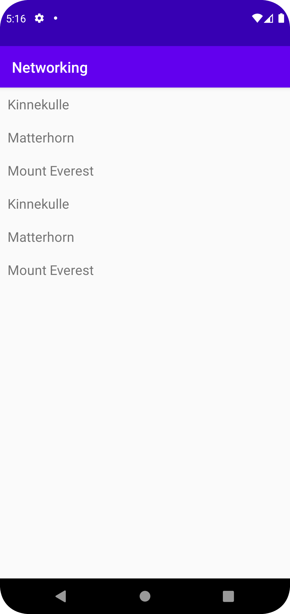

Först lades det till en ny fil med recycler view, sedan in med all kod där som finns i lenasys. Sedan lades en ny mountain.java till där kod från lenasys även var tagen, det var även under denna punkten som arraylisten lades till. Efter detta löstes allt med recycleviewadaptern i MainActicity.java, samt lades en "for" loop till som visas nedan för att visa upp mountain listan. Slutligen lades allt till som var nödvändigt för att JSON ska fungera i MainActivity.java samt internet kopplingen i manifest.

```
        for(Mountain m : mountainArrayList){
            RecyclerViewItems.add(new RecyclerViewItem(m.getName()));
        }
```

